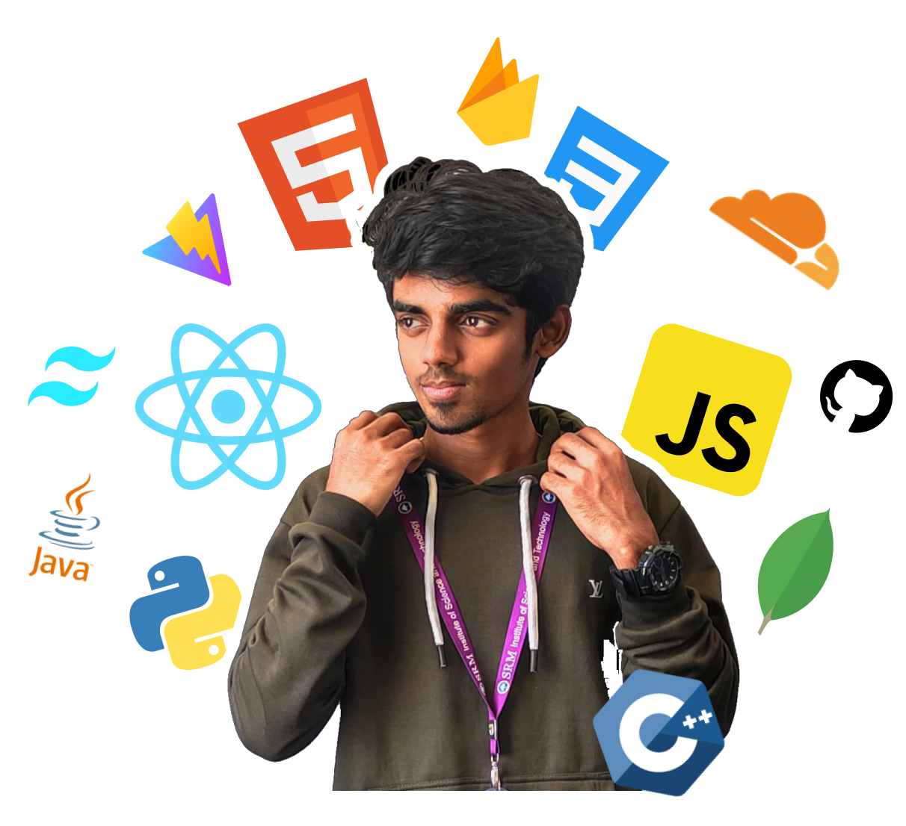

<h1 align="center">👋 Hi, I'm Mohammed Vaseem💚</h1>

  
   
  <b>💻 A passionate Web Developer and Tech Enthusiast</b>

---

### 🛠️ Tech Stack

  

---

### 👨‍💻 About Me
- 🎓 **Undergraduate Student**, currently in my final year.
- ✨ **Secretary of LiveWires Technical Club**, managing 30+ operations and projects.
- 💡 Delivered a **keynote on Web Development** at a bootcamp hosted by LiveWires.
- ⚡ Participated in **10+ hackathons**
- 🌱 Exploring **Machine Learning**
- 🌍 **Freelancer**

---

### 🔗 Let's Connect!

  
  
  

---

### 🌟 Fun Fact
"Every project I create is crafted with precision, passion, and a sprinkle of innovation! 🚀"
